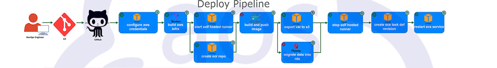
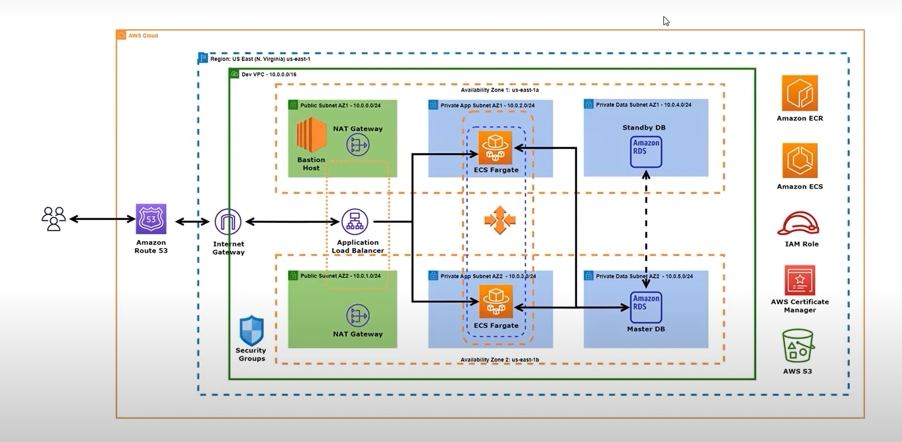

# Project Title: CI/CD Pipeline for Dynamic Web Application Hosting on AWS with Terraform, Docker, ECR, ECS, and GitHub Actions

## Project Overview

This project outlines the setup of a CI/CD pipeline for deploying a dynamic web application on AWS using Terraform for infrastructure provisioning, Docker for containerization, Amazon Elastic Container Registry (ECR) for storing Docker images, Amazon Elastic Container Service (ECS) for running containerized applications, and GitHub Actions for automating the build and deployment process. The setup includes creating a Virtual Private Cloud (VPC), ECS Fargate service, RDS database, and configuring an Application Load Balancer (ALB) with SSL termination.

## Architecture 
  
  

## Prerequisites

Before starting, ensure you have the following:

- **Terraform**: To provision AWS resources.
- **Git**: For version control and managing your project repository.
- A code editor (e.g., **VSCode**, **Sublime Text**).
- **AWS CLI**: To interact with AWS services from the command line.
- An AWS **IAM User** with sufficient permissions to provision infrastructure resources.
- SSH **Key Pairs**: For accessing EC2 instances if necessary.
- An AWS account with access to necessary services (S3, ECS, RDS, etc.).
- A **GitHub** account and repository for storing code and workflows.
- **Docker**: For building and containerizing the application.
- **Flyway** (or a similar tool) for managing database migrations.

## Installation

### Step 1: Initial Setup

1. **Install required tools** on your local machine:
   - Terraform
   - AWS CLI
   - Docker
   - Git

2. **Create a Git repository** for the project and clone it to your local machine:
   ```bash
   git clone https://github.com/your-username/your-repository.git
   cd your-repository
   ```

### Step 2: AWS Configuration

3. **Create an IAM user** in AWS with the required permissions for provisioning and managing resources.

4. **Generate access keys** for the IAM user and configure the AWS CLI on your machine:
   ```bash
   aws configure
   ```
   Enter the **Access Key ID**, **Secret Access Key**, and default region as needed.

5. **Set up S3 and DynamoDB** for managing Terraform state:
   - Create an S3 bucket to store the Terraform state file.
   - Create a DynamoDB table to enable state locking for Terraform.

6. **Clone or create a Git repository** for storing your Terraform modules if needed.

### Step 3: Infrastructure Setup

7. **Write Terraform modules** to define resources such as the VPC, ECS cluster, task definitions, and RDS instance.

8. **Configure the AWS provider in Terraform** to authenticate and connect to AWS:
   ```hcl
   provider "aws" {
     region = "us-west-2"
     profile = "your-aws-profile"
   }
   ```

9. **Configure Terraform backend** to store the state in the S3 bucket and use the DynamoDB table for state locking:
   ```hcl
   terraform {
     backend "s3" {
       bucket = "your-terraform-state-bucket"
       key    = "path/to/state/file"
       region = "us-west-2"
       dynamodb_table = "terraform-lock-table"
     }
   }
   ```

10. **Create the required AWS resources** (such as VPC, subnets, security groups, ECS service, RDS instance) using Terraform.

### Step 4: CI/CD Pipeline Setup

12. **Create a GitHub Actions workflow file** in `.github/workflows/main.yml` to automate the CI/CD process for provisioning infrastructure and deploying the application.

13. **Add repository secrets** to GitHub, which will be used by the pipeline:
    - `AWS_ACCESS_KEY_ID`
    - `AWS_SECRET_ACCESS_KEY`
    - `DOCKER_USERNAME`
    - `DOCKER_PASSWORD`

14. **Configure jobs in the pipeline** to authenticate with AWS, provision infrastructure using Terraform, build Docker images, and push them to Amazon ECR.

15. **Set up Docker in the pipeline** to containerize the application and deploy it on the ECS Fargate service.

## Usage

To deploy the application:

1. **Push your code** to the GitHub repository to trigger the CI/CD pipeline.
2. **Monitor the pipeline's progress** on the GitHub Actions tab to ensure all steps complete successfully.
3. Once the pipeline is executed successfully:
   - Terraform will provision the required AWS resources.
   - Docker will build the application image and push it to Amazon ECR.
   - The ECS Fargate service will automatically pull the latest Docker image and deploy it.

## Contribution Guidelines

Contributions are welcome! To contribute, please follow these steps:

1. Fork the repository.
2. Create a new branch for your feature or bug fix.
3. Ensure your code adheres to the project’s standards and is well-documented.
4. Submit a pull request with a detailed explanation of your changes.
